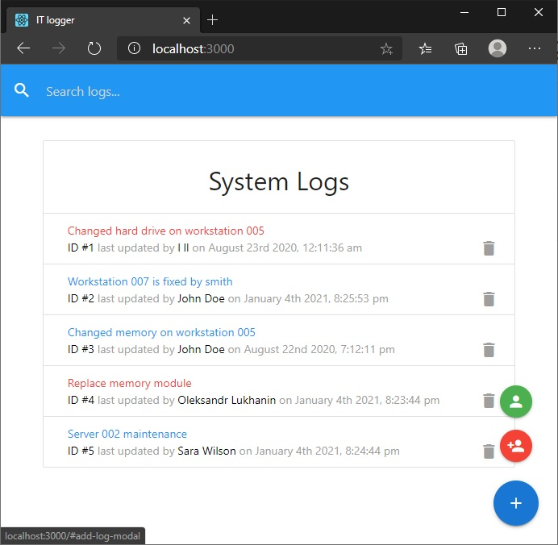
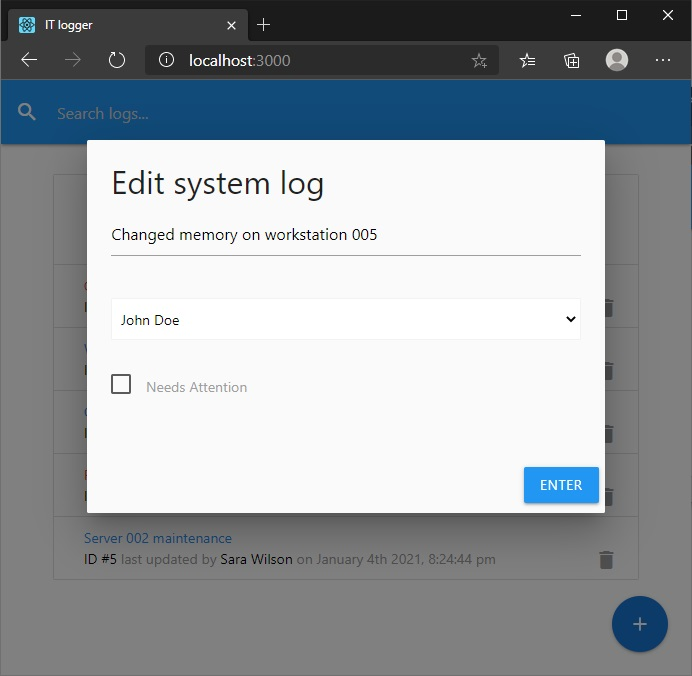
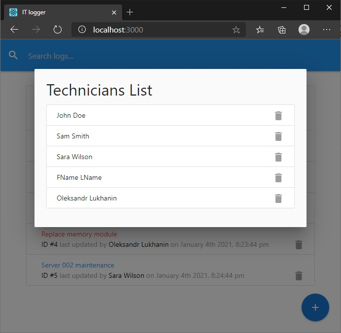

# ITLogger

## Description

React app to track IT department tasks and issues. Uses JSON-Server as a mock backend.

<p align="center">
  
   
  
  

</p>

## Technology stack

- React
- React Hooks
- Redux with HOCs
- Materialize-CSS
- JSON-server
  <br>

# Usage

Clone this repository to desired location

```Shell
git clone https://github.com/XanderUZZZER/it-logger.git
```

<br>

Open cloned project in your editor and install dependencies:

```Shell
npm i
```

<br>
To run the app execute:

```Shell
npm run dev
```

Your app will be running in development mode on [http://localhost:3000](http://localhost:3000).  
JSON-server will be running on [http://localhost:5000](http://localhost:5000)
<br>

<br>
To run the app:

```Shell
npm run start
```

<br>
To run the JSON-server:

```Shell
npm run json-server
```

<br>
To build the app for production run:

```Shell
npm run build
```

<br>
